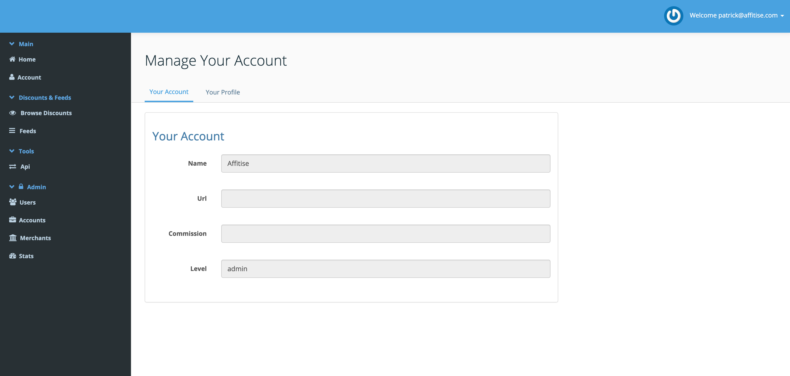
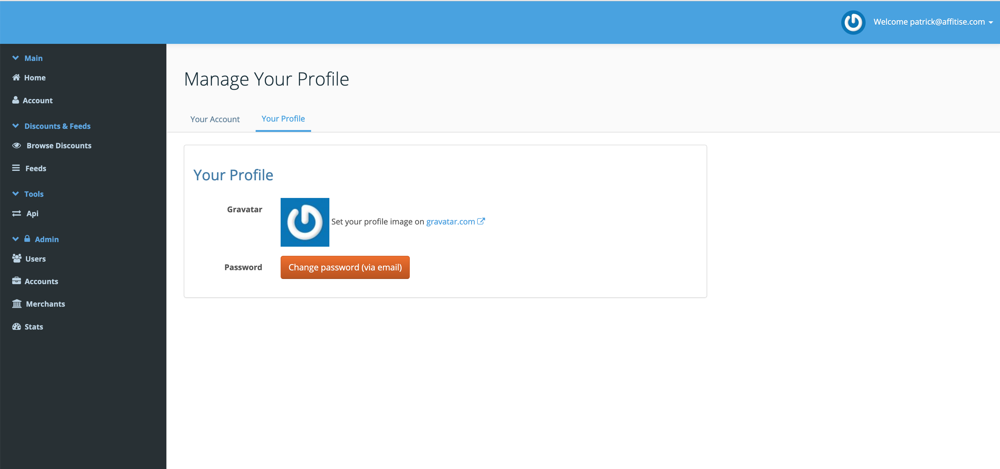
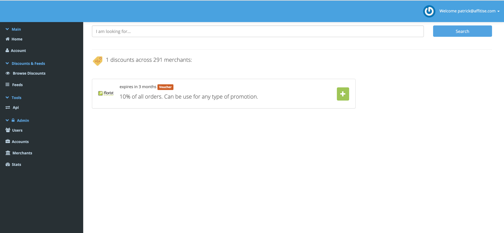
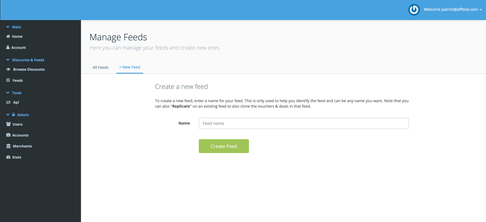



## Key Technologies:


## Company Intro:

[Affitise](https://affitise.com) is a whitelabel site that allows websites to easily embed voucher codes on their website and gain affiliate comissions on use. This allows the website owner to provide adverts to their users that are actually useful.

## Project Details:

Affitise is a startup and I was tasked with creating a MVP from concept. I worked with the founder to improve the backend systems and create a few more javascript widget sizes. The company was eventually sold to another player in the market.

## Team Composition & My Role:

I was the sole developer on the project and created the website and javascript widgets for use in embedding.

## Website Screenshots:

